*Image from https://solarsystem.nasa.gov/resources/758/brief-outburst/?category=solar-system_sun*

With Google Tag Manager Server-side (GTM-SS), the scope on what you can do with your GA4 events is much enhanced, since using GTM-SS you have the ability to interact easily with other GCP services, in particular easier Google authentication.  This integration can allow you to enrich your data streams or send your GA4 data to different locations other than the Google Marketing Platform.  The first example of this has been using the BigQuery API in your GTM-SS templates to export your event data, but what if you need your event data on a more real-time basis?  For that, there is [Google Pub/Sub](https://cloud.google.com/pubsub/docs/overview).

<!--more-->

Pub/Sub is a way for you to react to your GA4 real-time event data with any GCP system such as Dataflow, Cloud Run, Cloud Build or Cloud Functions.  This post will look at how to implement it and some applications.

<iframe width="560" height="315" src="https://www.youtube-nocookie.com/embed/cvu53CnZmGI" title="YouTube video player" frameborder="0" allow="accelerometer; autoplay; clipboard-write; encrypted-media; gyroscope; picture-in-picture" allowfullscreen></iframe>

## Why send GA4 data to Pub/Sub

Lukas Oldenburg has written about this before with regards to using [GTM-SS for visitor stitching](https://lukas-oldenburg.medium.com/use-google-tag-manager-server-side-for-visitor-stitching-by-querying-a-gcp-database-in-real-time-644001068a1c) and I've touched on it with my using [GTM-SS to trigger Slack webhook events](https://code.markedmondson.me/gtm-serverside-webhooks/) so this post expands upon those as I've worked with it over the last year.   This latest iteration is I think the most robust so far - expandable to many applications and using the right tool for each job via PubSub, Cloud build and GTM Clients.

Once you have your data flowing through Pub/Sub, you can route it directly to a whole slew of GCP services, such as Cloud Functions, Cloud Run, DataFlow, BigQuery, Cloud Build and others. These services can do more above and beyond what a JavaScript tag or client can do, so subsequently you can expand the horizons on what your digital analytics data can do.
 
This can include triggering workflows for:

* sending emails or triggers to yourself (A customer just bought this!)
* sending something to the customer themselves if you know them (You just bought this!)
* Transforming and filtering your GA4 data, perhaps by using the Data Loss Prevention API to redact credit card numbers, email address etc before it hits BigQuery
* Enriching GA4 data with other data (such as 1st or 2nd party data)

For my own blog I didn't know anything that would be actually useful so worth writing about, until I came across an idea of sending your own data to you in an email for your blog browsing history (yes dear reader, YOUR data).  For this I would want to cross reference your `cookie_id` (you can see this value if you examine your cookies as you read this page) with an email form.  This I think would be very nice to be available on more websites, giving the privacy climate and GDPR philosophy of control of your own data - a website who lets you do this demonstrates trust I think, and Trust is a KPI now.  I can also think e-commerce websites would benefit from a form to easily send customers all the products they have browsed in their historic sessions, in a kind of automatically created shopping list. 

For this use case I'll show how GA4, GTM-SS and GCP can achieve this so as perhaps you can develop it for something useful for your own website.  

The dataflow will be:

* Web form with email push to GTM dataLayer for event `ga4_email`
* Create a GA4 event from the dataLayer event `ga4_email` and send to my GTM-SS
* Use a PubSub tag in my GTM-SS to send the `ga4_email` data to a PubSub topic: `gtm-ss-form_submit`
* Trigger a Cloud Build that will cross reference your cookie_id history in the GA4 BigQuery export, then send it to the email you have provided.

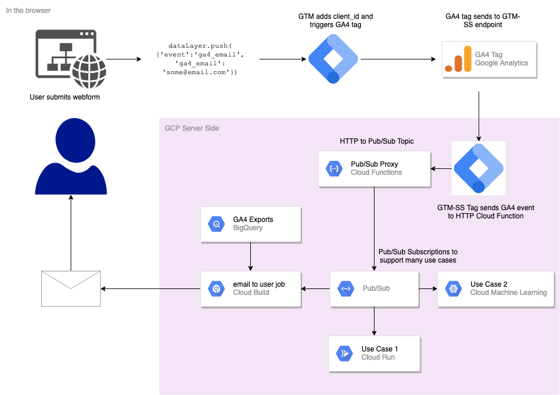
*Data architecture for code included in this blog post*

This is using technology I am writing about in the upcoming [Learning Google Analytics - GA4 cloud applications book](https://code.markedmondson.me/writing-a-book/).  I'll try to highlight what part of the data architecture I'm talking about via some red rectangles.

### Triggering email flows with GA4

The first section is about how to get the data from the web form to GTM-SS.

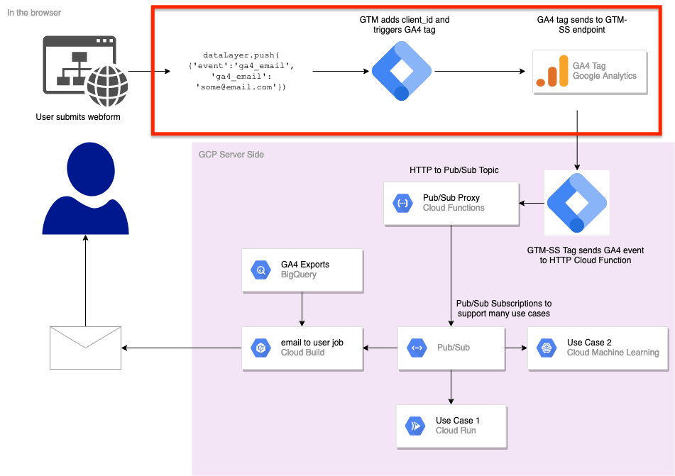
*This section tackles moving data from the dataLayer to GTM-SS*

A new form has appeared on my blog that allows you to get the GA4 browsing history of your cookie_id sent to your email.  This form takes the email you put in it and pushes it to the `dataLayer()` in an event called `ga4_email`, and should be similar to other website form tracking.

```html
<script>
  function submitDL(value){
    dataLayer.push({'event':'ga4_email','ga4_email':value});
    document.getElementById('email').value = 'Submitted! See inbox'
    var button = document.getElementById('email_button');
    button.disabled = true;
  }
    
</script>
<div>
    <input type="email" name="email"  id="email"
      required 
      minlength="8"
      placeholder="you@email.com">
    <button id='email_button'
      onclick="javascript:submitDL(document.getElementById('email').value);"
     >Send</button>
</div>
```
*Code example 1: HTML to set up a simple form that will send the contents to the GTM dataLayer*

This makes the form to the right → or at the bottom of the page on mobile ↓.

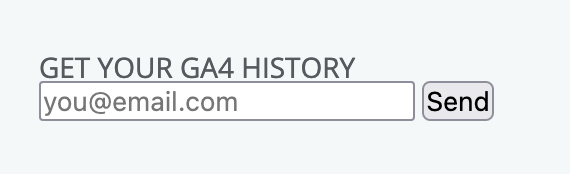
*rendered HTML form in the blog's right sidebar*

I send the email you fill in to the GA4 tag - oh no!  I'm not allowed to send PII into Google Analytics though right?  Yes - so the GA4 tag is only used to send in the data to GTM-SS (so we only need one tag firing), and then we exclude that parameter in the GA4 server-side tag:

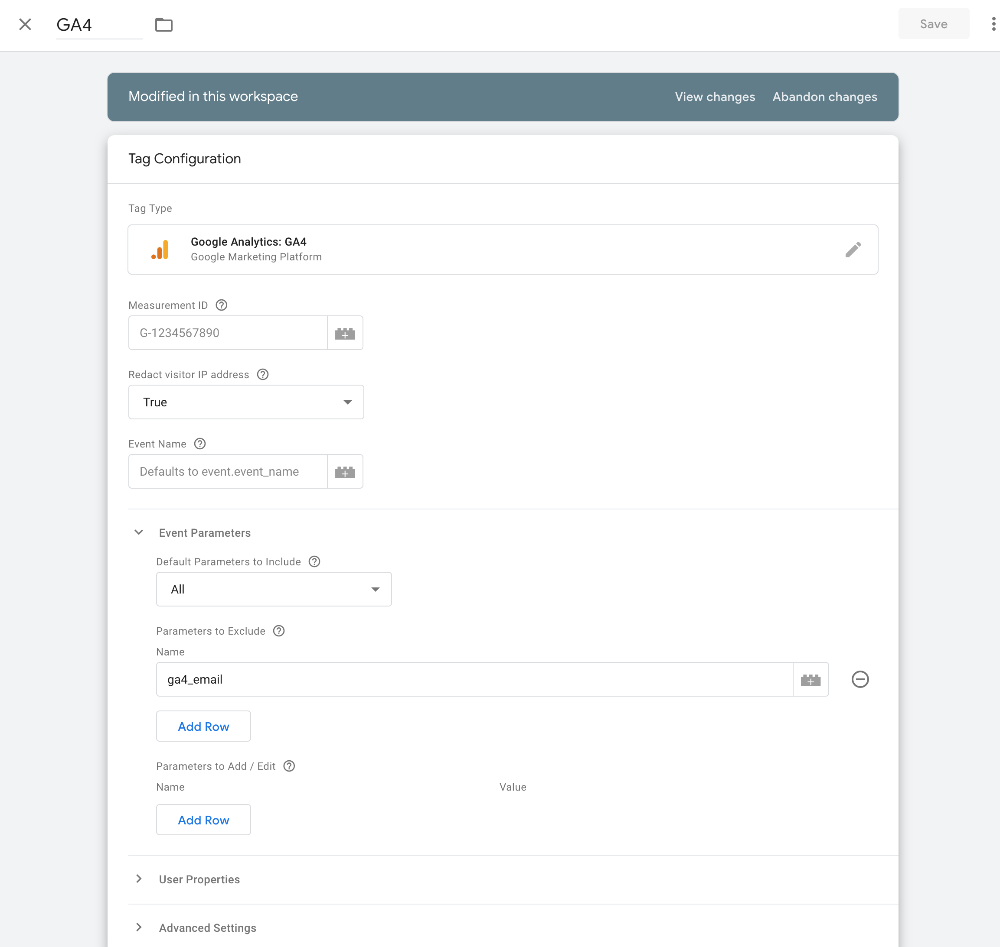
*Redacting the ga4_email event from the GA4 tag to avoid sending PII*

We would like to send the email to a more secure platform, but piggy back off the GA4 tag.  This is much in keeping with my new philosophy for server-side tracking, trying to minimise the amount of tags browser-side and moving the work to the server to improve security and performance. 

## Sending the GA4 ga4_email to GTM-SS

Within GTM browser side I use Simo's handy [GTAG GET API tag template](https://www.simoahava.com/custom-templates/gtag-get-api/) to pick up the dataLayer value and send it as a GA4 event tag. I need the `client_id`, `session_id` and the value of the `ga4_email` dataLayer variable, and trigger the GA4 tag to fire on the dataLayer's `ga4_email` event that the email submission created.  The GA4 tag is using the GA settings that send to my GTM-SS instance on `https://gtm2.markedmondson.me` (the [GTM-SS deployed on Cloud Run](https://code.markedmondson.me/gtm-serverside-cloudrun/))

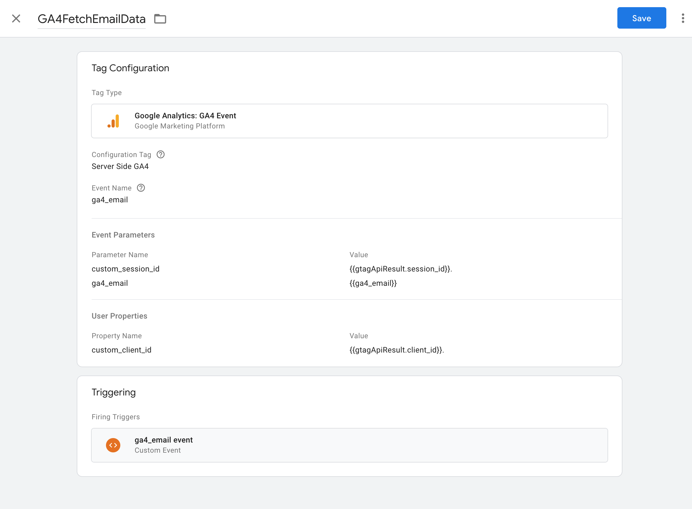
*Setting up the GA4 event tag for the ga4_email event*

This sends in the data into GTM-SS with the value of the email and the other Ids I'll use down stream.

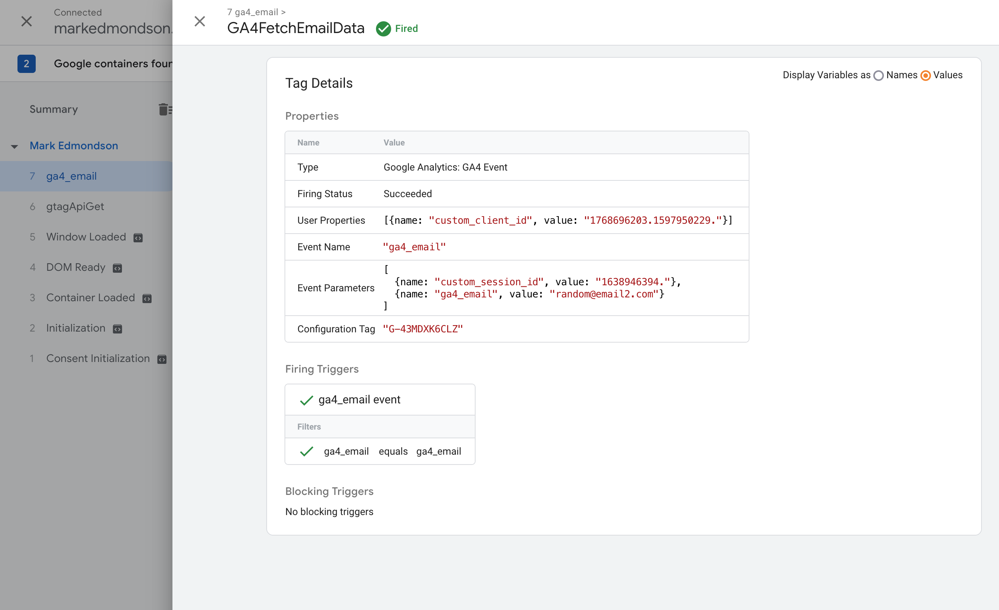
*Debugging preview showing successful sending of the ga4_email event from the client side GTM*

### GTM-ServerSide Tag for GA4 Events -> HTTP Cloud Function

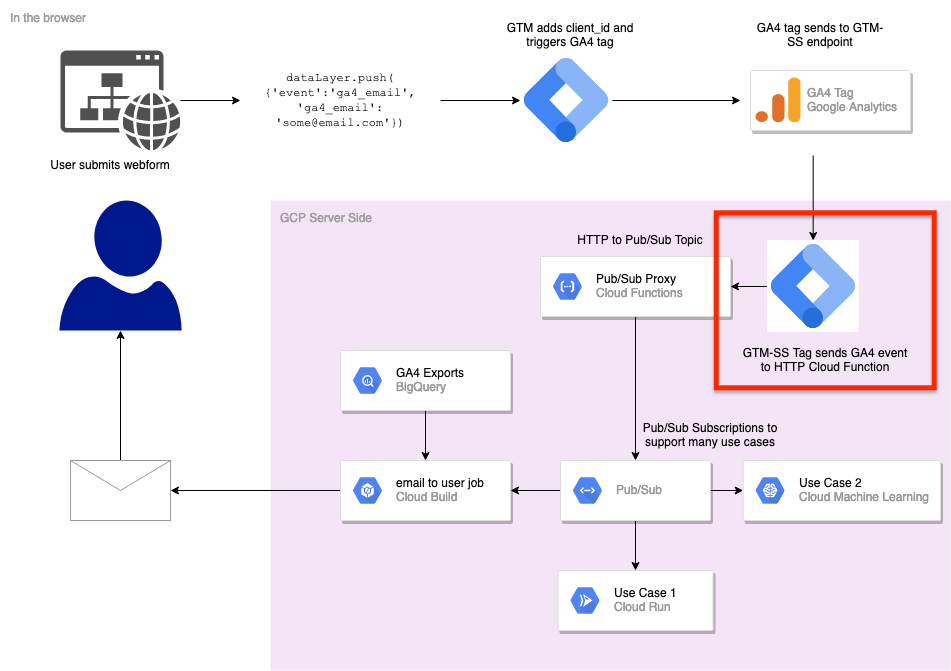
*This section sends the data hitting GTM-SS to a Cloud Function*

Once the event hits GTM-SS, we want to turn that event data into a PubSub topic.  I'll do this with the GTM-SS tag template below, which assumes you have deployed a HTTP Cloud Function we will cover in the next section.

When creating tags in GTM Server-Side you need to make them via the template feature with a sandboxed version of JavaScript.  A possible implementation is shown below:

```js
const getAllEventData = require('getAllEventData');
const log = require("logToConsole");
const JSON = require("JSON");
const sendHttpRequest = require('sendHttpRequest');

log(data);

const postBody = JSON.stringify(getAllEventData());

log('postBody parsed to:', postBody);

const url = data.endpoint + '/' + data.topic_path;

log('Sending event data to:' + url);

const options = {method: 'POST', 
                 headers: {'Content-Type':'application/json'}};

// Sends a POST request
sendHttpRequest(url, (statusCode) => {
  if (statusCode >= 200 && statusCode < 300) {
    data.gtmOnSuccess();
  } else {
    data.gtmOnFailure();
  }
}, options, postBody);
```
*Code example 2: GTM Server Side template code for a tag to send all GTM-SS event data to your HTTP endpoint*

The GTM tag calls for two data fields to be added:

* *data.endpoint*  - This will be the URL of your deployed Cloud Function given to you after your deployment, which will look something like `https://europe-west3-project-id.cloudfunctions.net/http-to-pubsub`

* *data.topic_path* - This will be the name of the Pub/Sub topic it will create.

Its a small template, as all it really does is forward on the event to the HTTP endpoint.

We will want a tag created from this template to trigger on the `ga4_email` event sent in via GA4 in the previous section. You could also trigger it on every event for other downstream purposes, such as sending everything to DataFlow or BigQuery, but we only need it for this particular event.

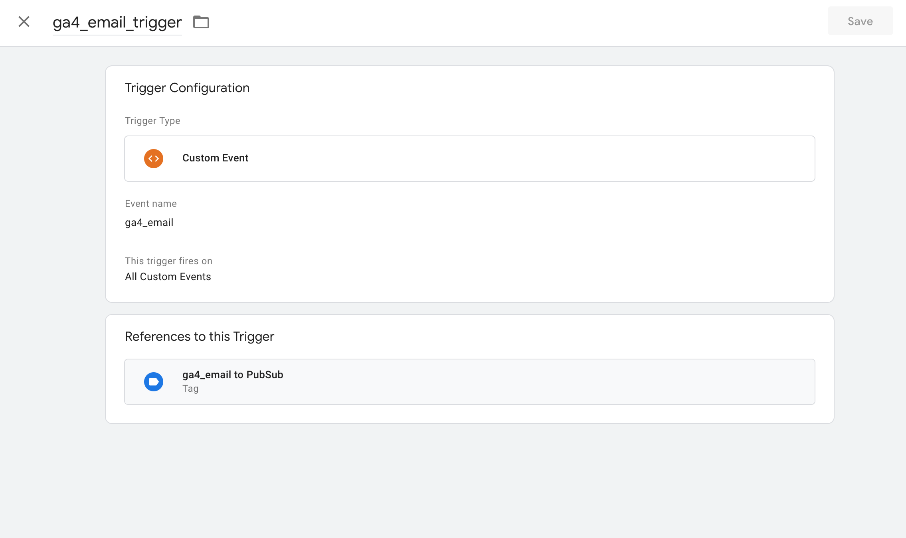
*A trigger for ga4_email in GTM-SS for the PubSub tag*

You can then create the tag from the template and trigger it with the above, filling in the HTTP endpoint for the Cloud Function we will talk about next.  I guess if you are following this in chronological order just save the tag for now and come back and fill in the HTTP value.  I had one I had prepared earlier (for the book) so I can just fill it in here.  

Its a nice process as it will create the PubSub topic for you based off the name of the URL path you put in the GTM-SS tag configuration, and you can control what data gets published via the GTM triggers so all familiar if you are used to configuring other tags. 

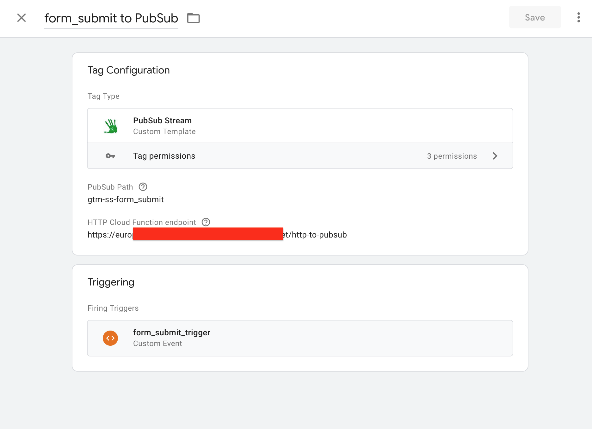
*Setting up the PubSub GTM-SS tag*

Now when you publish and debug via preview you should see the GTM client side sending the event, and the GTM server-side tag responding with the PubSub tag:

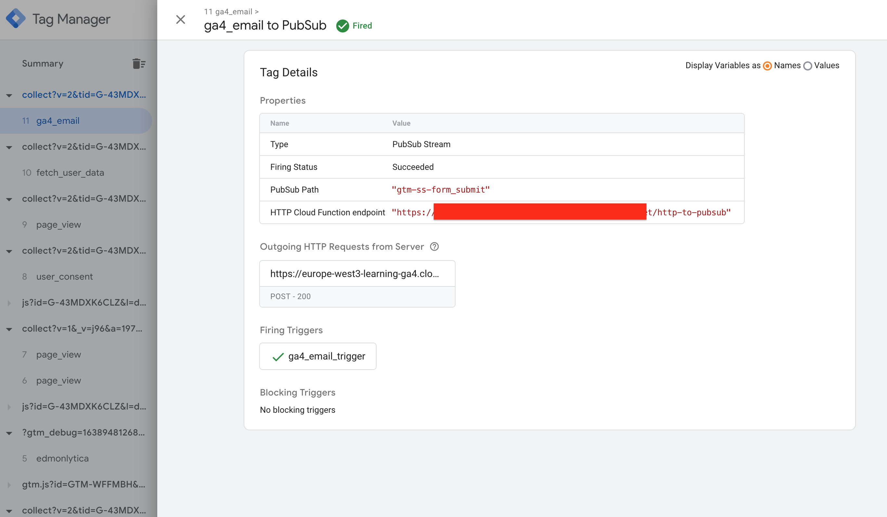
*A debug preview session showing a successful GTM-SS tag triggered*

### Cloud Function for HTTP-> Pub/Sub

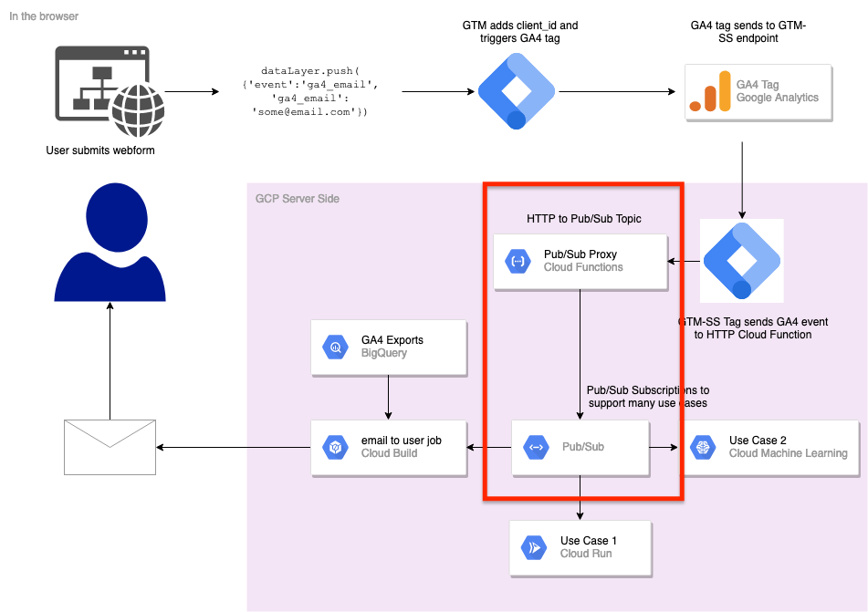
*This section turns the HTTP Cloud Function request into a PubSub topic*

Next the data will move to the Cloud Function that will turn the HTTP data sent from GTM-SS (or any other source if you want) and turn it into a PubSub topic.  This function has been created to be as generic as possible so will pass on data you push into it and create PubSub topics as necessary.

The Cloud Function is written in Python 3.9, and will take any HTTP POST request and turn its body data into a PubSub topic the same name as its endpoint path (e.g. POST to `/hello-mum` with a HTTP body of `{"mydata":{"key1":"value1"}}` will turn it into a Pub/Sub topic of the same with the data as the event message for consumption by downstream subscriptions - the code to achieve this is as shown below:

```{python}
import os, json
from google.cloud import pubsub_v1 # google-cloud-pubsub==2.8.0

def http_to_pubsub(request):
    request_json = request.get_json()

    print('Request json: {}'.format(request_json))

    if request_json:
        res = trigger(json.dumps(request_json).encode('utf-8'), request.path)
        return res
    else:
        return 'No data found', 204


def trigger(data, topic_name):
  publisher = pubsub_v1.PublisherClient()

  topic_name = 'projects/{project_id}/topics{topic}'.format(
    project_id=os.getenv('GCP_PROJECT'),
    topic=topic_name,
  )

  print ('Publishing message to topic {}'.format(topic_name))
  
  # create topic if necessary
  try:
    future = publisher.publish(topic_name, data)
    future_return = future.result()
    print('Published message {}'.format(future_return))

    return future_return

  except Exception as e:
    print('Topic {} does not exist? Attempting to create it'.format(topic_name))
    print('Error: {}'.format(e))

    publisher.create_topic(name=topic_name)
    print ('Topic created ' + topic_name)

    return 'Topic Created', 201
```
*Code example 3: This Cloud Function will take a HTTP hit and turn the event data into a Pub/Sub topic of the same name as the endpoint path (e.g. POST to `/hello-mum` with a HTTP body of `{"mydata":{"key1":"value1"}}` creates a PubSub topic called `hello-mum` if required)*

Remember the `requirements.txt` file in the same folder with `google-cloud-pubsub==2.8.0` to pin the version of the PubSub library, and use the entry point as the function `http_to_pubsub()`.

You could paste this code in the WebUI for Cloud Functions, or the code can be deployed via `gcloud` as shown below, which once complete will give you a URL that you can use to POST your data to from any system.

```sh
gcloud functions deploy http-to-pubsub \
        --entry-point=http_to_pubsub \
        --runtime=python37 \
        --region=europe-west3 \
        --trigger-http \
        --allow-unauthenticated
```
*Deploying the Python Cloud Function.  This will create a HTTP URL for you to use in other applications such as GTM-SS*

I can be more relaxed about authentication since this will only be exposed server-side, although you could put more restrictions on it if you have a need such as an API key.

Once deployed you should have a URL you can put into the GTM-SS PubSub tag from the earlier section, of the form `https://region-project.cloudfunctions.net/http-to-pusub`.

Take that URL and plop it into the configuration of the PubSub GTM-SS tag, publish the tag and then make a few test form submissions. You should pretty quickly (within 60 seconds) see the hits in the PubSub queue and invoking your Cloud Function:

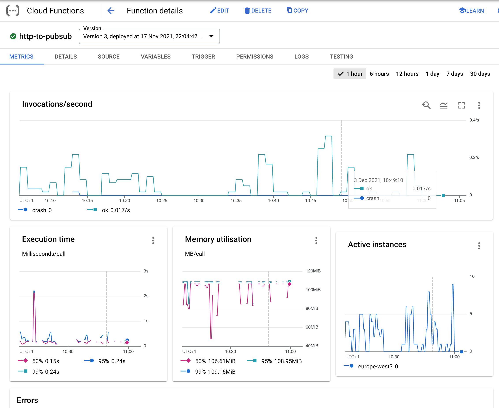
*Metrics for the Cloud function being invoked from HTTP requests*

Subsequently you should see [a listing for PubSub topic created](https://console.cloud.google.com/cloudpubsub/topic/list) with the same name as the URL path stem from the GTM-SS config (`gtm-ss-form_submit` in my example).  I tend to make a simple subscription to the PubSub topics called `topic-debug` so I can examine the messages sent.  Doing that I see message content for the `ga4_email` in my PubSub message queue:

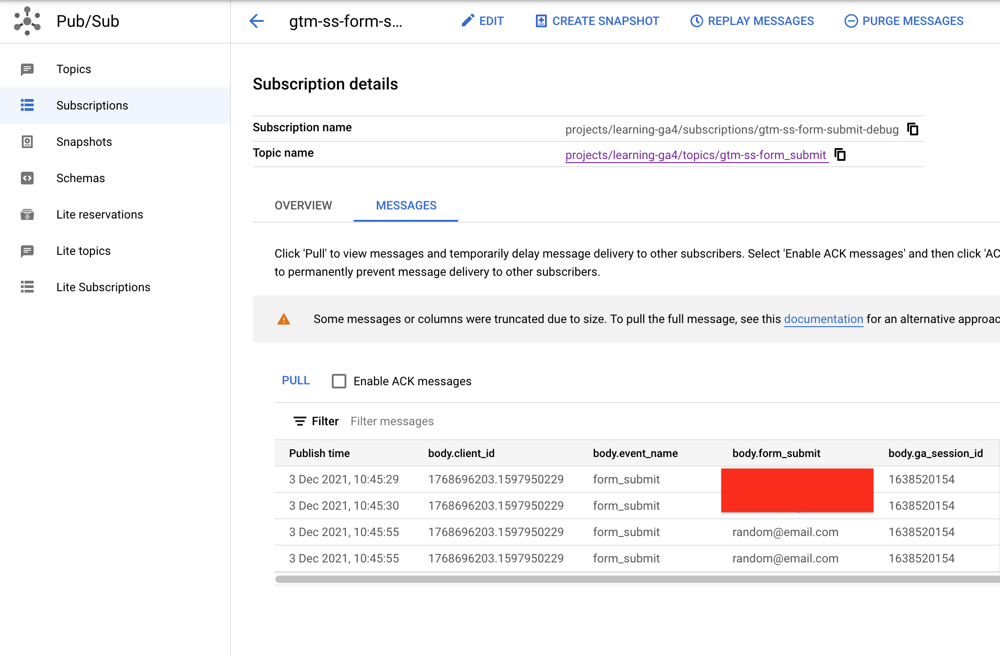
*Messages received in the PubSub Topic*

This PubSub topic can be used for a variety of purposes but for this example I'll consume the data to trigger a Cloud Build that will send the GA4 data to the email provided.  I choose Cloud Build as its very flexible so long as you have a Docker container to run your code within. 

### Cloud Build for fetching BigQuery data, sending the email

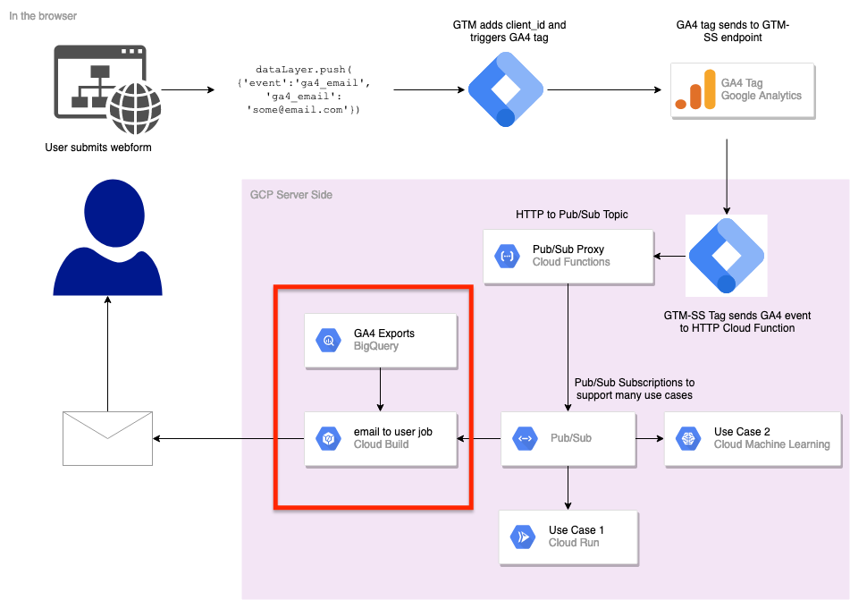
*This section takes the data coming in from the PubSub topic and runs a script that queries BigQuery and sends an email*

Now you have the event coming in to Pub/Sub, you can take that event and pass it to other systems.  For this example, we will use it to trigger Cloud Build using a feature I just added to `googleCloudRunner`, where you can pass parameters from a PubSub message into a Cloud Build to parametrise its action (some documentation on [Pub/Sub triggered cloud builds here](https://code.markedmondson.me/googleCloudRunner/articles/cloudbuild.html#pub-sub-triggered-cloud-builds)).  

It is a bit slower than other choices though, since it needs to download and run the docker containers involved.  For more responsiveness you may want to look at DataFlow or Cloud Run/Functions. 

The form of the PubSub message coming in is something like the below example which is an event from myself checking it in the GTM preview:

```json
{"x-ga-protocol_version": "2", 
"x-ga-measurement_id": "G-43MDXK6CLZ", 
"x-ga-gtm_version": "2rec10", 
"x-ga-page_id": 761826058, 
"screen_resolution": "2560x1440", 
"x-ga-system_properties": {"dbg": "1"}, 
"language": "en-gb", 
"client_id": "1768696203.151234345", 
"x-ga-request_count": 5, 
"page_location": "https://code.markedmondson.me/?gtm_debug=1638524719562", 
"page_referrer": "https://tagassistant.google.com/", 
"page_title": "Mark Edmondson", 
"ga_session_id": "1638520154", 
"ga_session_number": 345, 
"x-ga-mp2-seg": "1", 
"event_name": "ga4_email", 
"engagement_time_msec": 1, 
"debug_mode": "true", 
"custom_session_id": "1638520154.", 
"ga4_email": "an_email@gmail.com", 
"ip_override": "123.456.789.876", 
"user_agent": "Mozilla/5.0 (Macintosh; Intel Mac OS X 10.15; rv:94.0) Gecko/20100101 Firefox/94.0", 
"x-ga-gcs-origin": "not-specified", 
"user_id": "xloAW6qkF2NSc0xqQ45otXXXXXXpYGY="} 
```
*Sample JSON from a PubSub event populated by the GA4 tag*

For the script I only need the `ga4_email` email address and the `client_id` which is the ID in the cookie.  Following the documentation for [Cloud Build payload bindings](https://cloud.google.com/build/docs/configuring-builds/use-bash-and-bindings-in-substitutions) these can be used within a PubSub triggered Cloud Build via:

```yaml
steps:
- name: 'rocker/r-base'
  id: Echo PubSub vars
  args: ["Rscript", "-e", "paste('From PubSub message:', '${_EMAIL}', '${_CLIENT_ID}')"]
substitutions:
  _EMAIL: '$(body.message.data.ga4_email)'
  _CLIENT_ID: '$(body.message.data.client_id)'
```
*Example cloudbuild.yml for Cloud Build to pick up values from the PubSub message that triggers the build*

I used an R step just to demo it can be any language you use within it.

I'll just deploy that first quickly in the console to see if its coming in ok - setting up a new Cloud Build invoked by the `gtm-ss-form_submit` PubSub topic and using the in-line editor to put in the YAML:

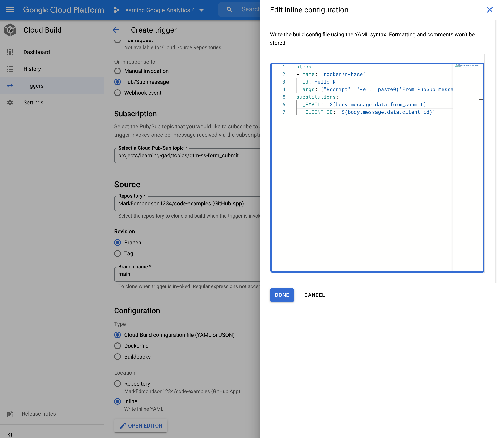
*Setting up a Cloud Build trigger using the inline configuration within the GCP console*

I go to my website and submit a test email, and within a few seconds I see a [build in the log for the trigger I created](https://console.cloud.google.com/cloud-build/builds).  The build log runs the R code and it echoes back the form data - we are nearly there!

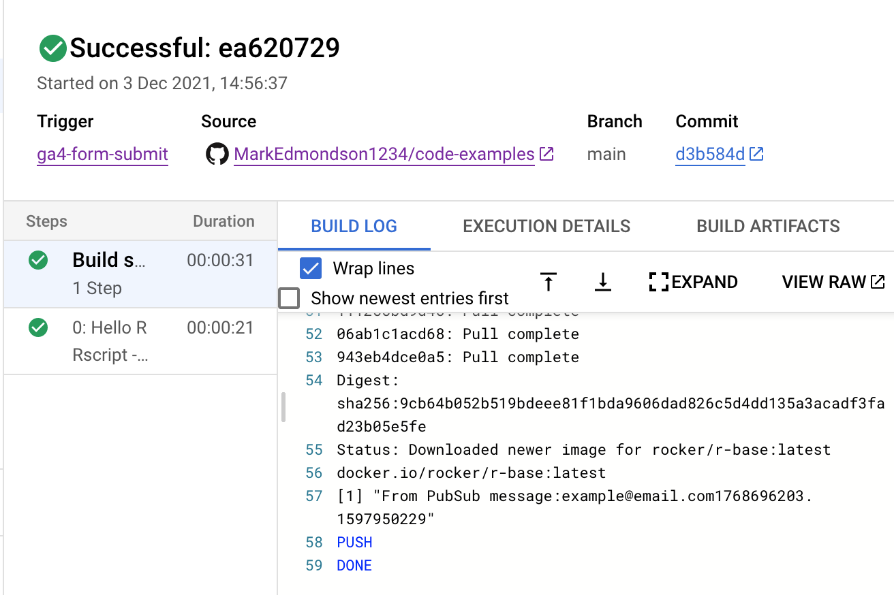
*Inspecting the Cloud Build logs to see if the build trigger worked*

Now I only need an script to take my variables and do "stuff", and since we're on Cloud build it can be any language since its Docker container led in each step. 

The SQL for the report I want is generated by this:

```sql
SELECT
    timestamp_micros(event_timestamp) as event_timestamp,
    user_pseudo_id ,
    event_name,
    TIMESTAMP_MICROS(user_first_touch_timestamp) as first_touch,
    (SELECT value.string_value FROM UNNEST(event_params) WHERE key = 'page_location') as page_location,
    (SELECT value.string_value FROM UNNEST(event_params) WHERE key = 'page_referrer') as page_referrer
FROM
    `my-project.analytics_206671234.events_*`
WHERE
    _table_suffix between format_date('%Y%m%d',date_sub(current_date(), interval 90 day)) 
       and format_date('%Y%m%d',date_sub(current_date(), interval 0 day))
    and event_name = 'page_view' 
    and user_pseudo_id = '${_CLIENT_ID}'
```
*SQL to return the page_view events for a specific client_id from a BigQuery GA4 export*

I have a `gcr.io/gcer-public/googleauthr-verse` docker container that contains all of my R packages, including `bigQueryR` that can query the GA4 dataset, and I've added [`blastula` a package for sending nice emails](https://pkgs.rstudio.com/blastula) using [`googleAuthR::cr_deploy_docker_trigger()`](https://code.markedmondson.me/googleCloudRunner/reference/cr_deploy_docker_trigger.html) to create it, giving me a `gcr.io/gcer-public/googleauthr-blast` docker image I can use as the R environment for my build steps.  I have to say [`googleCloudRunner`](https://code.markedmondson.me/googleCloudRunner/) has saved me personally a lot of time automating set-ups like this, and is my favourite tool. 

#### Calling BigQuery

Now I have my Docker environment set-up, I need the script to call BigQuery and send the email.  [bigQueryR](https://code.markedmondson.me/bigQueryR/) can take advantage of itself running on Cloud Build to auto-authenticate itself so long as you add the Cloud Build email as a BigQuery Admin in the IAM.

```r
library(bigQueryR)
googleAuthR::gar_gce_auth()

# the GA4 dataset
bqr_global_dataset("analytics_206670707")

query_client_id <- function(client_id, sql_file){

  # read in SQL file and interpolate client_id
  sql <- readChar(sql_file, file.size(sql_file))
  sql_client_id <- sprintf(sql, client_id)
  
  results <- bqr_query(
    query = sql_client_id,
    useLegacySql=FALSE
  )
  
  if(nrow(results) > 0){
    message("Writing ", nrow(results), " rows to bigquery_results.csv")
    write.csv(results, file = "bigquery_results.csv", row.names = FALSE)
  } else {
    message("No data found for ", client_id)
  }
  
  TRUE

}
```
*R code running in a Cloud Build step to query BigQuery for the client_id data and save to a CSV*

You could replace this with `gcloud` or Python or any code you like to query BigQuery, I just have this all handy from other work so its a quick start up time to reuse it.

#### Sending the email

The [R library blastula](https://github.com/rstudio/blastula) has the ability to make markdown emails which render to [beautiful HTML emails](https://solutions.rstudio.com/r/blastula/), so I use that to generate the email itself.  This email doesn't showcase its capabilities but when I expand on this privately it will be the framework to use.

```r
library(blastula)
creds <- creds_file("/workspace/blastula_gmail_creds")
email %>%
  smtp_send(
    to = "jane_doe@example.com",
    from = "joe_public@example.net",
    subject = "Testing the `smtp_send()` function",
    credentials = creds
  )
```

#### Build yaml to coordinate the steps

I then used `googleCloudRunner` to generate the YAML below for my Cloud Build, that uses the Docker containers and scripts within to 

* Download my secret email credentials
* Query BigQuery for the data for the client_id
* Send an email with the BigQuery data to the user's email

```{yaml}
steps:
  - name: gcr.io/cloud-builders/gcloud
    args:
      - '-c'
      - >-
        gcloud secrets versions access latest --secret=blastula_gmail_creds  >
        /workspace/blastula_gmail_creds
    entrypoint: bash
  - name: gcr.io/gcer-public/googleauthr-blast
    env:
      - BQ_DEFAULT_PROJECT_ID=$PROJECT_ID
      - 'CLIENT_ID=${_CLIENT_ID}'
    args:
      - Rscript
      - /workspace/bigquery-clientid.R
  - name: gcr.io/gcer-public/googleauthr-blast
    env:
      - 'EMAIL=${_EMAIL}'
    args:
      - Rscript
      - /workspace/send_email.R
substitutions:
  _CLIENT_ID: $(body.message.data.client_id)
  _EMAIL: $(body.message.data.ga4_email)
```

After deployment, now when I submit the form on the website I see:

1. A dataLayer push
2. The GA4 tag firing sending data to GTM-SS
3. The GTM-SS tag passing on the data to Pub/Sub
4. The Pub/Sub triggering the Cloud Build
4. The Cloud Build trigger running my build steps above.  

Those build steps read in the email and client.id, create the email and send it to the email provided. 

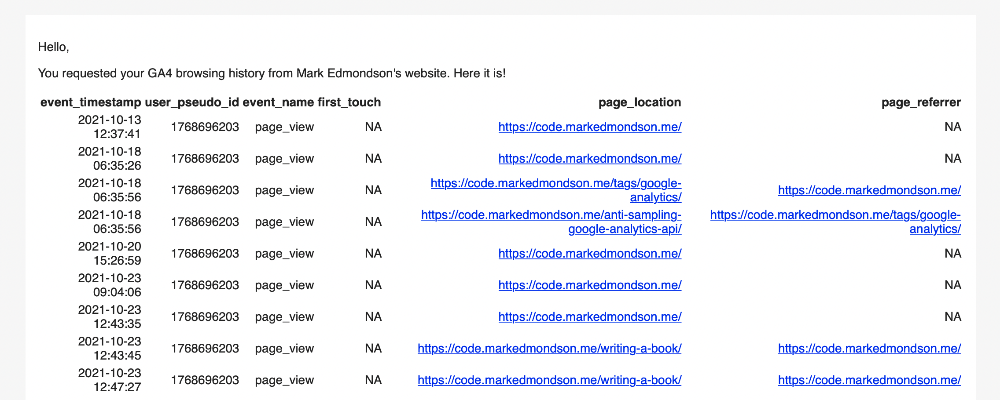
*The email appearing in my inbox*

## Summary

This may have been a wild tour through a GA4 data pipeline, but I hope if not followed in full at least components of it may spark your interest for your own use cases.  The advantages of involving PubSub in your workflows is having this loosely coupled message queue that micro-services that can all react to - for instance I could quite easily swap or add DataFlow as my activation channel, and quickly add new GA4 events to the stream since the GTM tag, Cloud Function etc. are all set up already.  With the tools in the tool box such as the Cloud Function and the GTM-SS tag template I am ready to respond to many other use cases taht come up and I anticipate 2022 will make use of these heavily.
